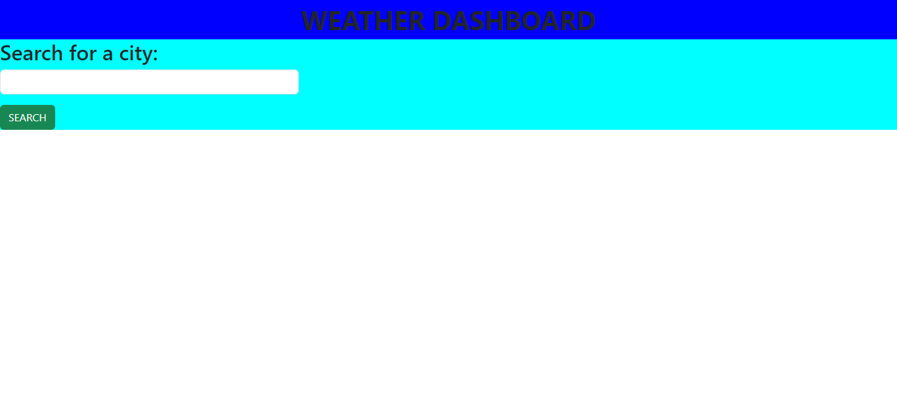

# Weather App 
I was asked to create an application that will fetch weather data and render a container and cards dynamically to the screen.

## Installation

1. I used HTML, CSS AND JavaScript in this application and made use of the openweatherapi.
2. I then deployed the project on GitPages.
3. Screenshot of deployed site: 

## Usage
Upon interaction the user will be presented with a search bar that they may input a city name into and have the current weather display as well as the five day forecast for that city. The search history with data will be saved into local storage for usage later.
```

## Contributing
There were two contributors to this project with me being the primary one and one of my classmates providing advice:
1. Samuel Wlodawski
2. Andres Albornez

## License

I employed no license in the creation of this project.